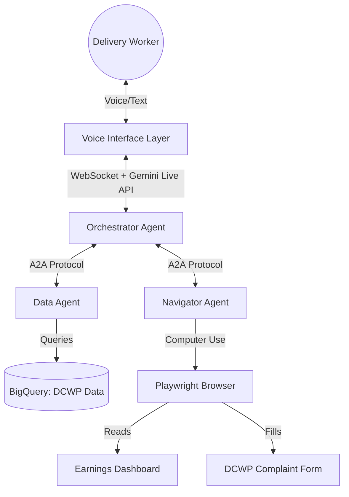

# GigNav - NYC Delivery Worker Equity Automator

**An autonomous multi-agent system with voice interface that monitors delivery worker earnings, detects wage theft using NYC DCWP data, and auto-files complaint forms through browser automation.**

Built for the 2026 NYC Google Cloud Hackathon | Track: UI Navigator | Dataset: "Gig Gap"

## The Problem

NYC's 70,000+ app-based delivery workers often earn below the city's minimum pay rate of **$22.13/hr**. Filing wage complaints is complex and time-consuming — workers who can least afford lost wages are least able to fight for them.

## The Solution

**GigNav** is a multi-agent AI system that:
1. **Hears** a worker describe their earnings via voice (Gemini Live API / STT)
2. **Analyzes** their pay against DCWP's real quarterly data via BigQuery (Data Agent)
3. **Sees** their earnings dashboard through Computer Use (Navigator Agent)
4. **Acts** by autonomously navigating and filling a NYC wage complaint form
5. **Speaks** results back to the worker (TTS)

All coordinated by an **A2A (Agent-to-Agent) orchestrator** using Google ADK.

## Architecture

GigNav utilizes a multi-tiered architecture built on the Google Agent Development Kit (ADK) and the Agent-to-Agent (A2A) protocol. The system is designed to provide a seamless voice interface while coordinating specialized AI agents to handle complex data and browser navigation tasks.

### 1. Voice Interface Layer
- **Components:** `voice_ui.html`, `voice_app.py`
- **Technology:** FastAPI, WebSockets, Gemini Live API (Bidi-Streaming), Web Speech API
- **Role:** Provides real-time, bi-directional audio and text communication between the delivery worker and the system.

### 2. Orchestrator Layer
- **Components:** `agents/orchestrator/agent.py`
- **Technology:** Google ADK, Gemini 2.5 Flash
- **Role:** The main coordinator. It manages the conversational state, interprets user requests, and delegates specific tasks to specialized sub-agents.

### 3. Specialized Agent Layer (A2A)
- **Data Agent (`agents/data_agent/agent.py`):** Uses DCWP quarterly data (via `data_tool.py` or BigQuery) to perform wage equity calculations, compare earnings against the NYC minimum rate ($22.13/hr), and generate complaint text.
- **Navigator Agent (`web_agent.py` / `agents/navigator_agent`):** A browser automation specialist powered by the Gemini 3 Flash Computer Use API and Playwright. It autonomously "reads" earnings screens to extract data and fills out NYC DCWP wage complaint forms.

### 4. Data & Environment Layer
- **BigQuery / DCWP Data:** Source of truth for NYC delivery worker statistics and minimum pay regulations (Admin Code 20-1522).
- **Computer Environments:** The delivery app dashboard (`mock_earnings.html`) and the DCWP wage complaint form (`mock_form.html`).



See `architecture.html` for the full visual diagram.

## Key Features

| Feature | Technology | Scoring Category |
|---------|-----------|-----------------|
| Voice Input/Output | Gemini Live API, Bidi-Streaming, Web Speech API | Innovation (40%) |
| Computer Use (Screen Reading + Form Fill) | Gemini 3 Flash Computer Use API | Innovation (40%) |
| Multi-Agent Coordination | Google ADK, A2A Protocol | Technical (30%) |
| Real-time Data Analysis | BigQuery + DCWP Dataset | Technical (30%) |
| Natural Conversation | Gemini 2.5 Flash | Innovation (40%) |
| Cloud Deployment | Cloud Build, Vertex AI | Bonus (+0.2) |

## Tech Stack

| Component | Technology |
|-----------|-----------|
| AI Models | Gemini 3 Flash (Computer Use), Gemini 2.5 Flash (Chat) |
| Agent Framework | Google ADK with A2A Protocol |
| Voice | Gemini Live API (Bidi-Streaming), STT/TTS |
| Data | BigQuery + DCWP Quarterly Reports |
| Browser Automation | Playwright + Computer Use API |
| Backend | FastAPI + WebSocket |
| Cloud | Google Cloud (Vertex AI, BigQuery) |

## Quick Start

```bash
# 1. Set environment
export GOOGLE_API_KEY=your_api_key
export GOOGLE_CLOUD_PROJECT=your_project
export GOOGLE_APPLICATION_CREDENTIALS=/path/to/credentials.json

# 2. Install dependencies
pip install -r requirements.txt
playwright install chromium

# 3. Upload DCWP data to BigQuery
python upload_to_bq.py

# 4. Run Voice App (Multi-Agent + Voice)
python voice_app.py
# Open http://localhost:8080

# 5. Run ADK Web UI (Multi-Agent Chat)
cd agents && adk web --port 8000
# Open http://localhost:8000

# 6. Run Computer Use Agent (Browser Automation)
python web_agent.py
```

Or use the deployment script:
```bash
chmod +x deploy.sh && ./deploy.sh
```

## Project Structure

```
gignav-core/
├── voice_app.py              # FastAPI voice app (Live API + WebSocket)
├── voice_ui.html             # Voice interface frontend (STT/TTS)
├── web_agent.py              # Computer Use agent (Gemini 3 Flash)
├── data_tool.py              # BigQuery integration & wage equity checker
├── agents/                   # ADK Multi-Agent System (A2A)
│   ├── orchestrator/         # Main coordinator agent
│   │   └── agent.py
│   ├── data_agent/           # DCWP data analysis agent
│   │   └── agent.py
│   └── navigator_agent/      # Browser automation agent
│       └── agent.py
├── gignav/                   # Standalone ADK agent
│   └── agent.py
├── mock_earnings.html        # Simulated delivery app earnings screen
├── mock_form.html            # Simulated NYC DCWP complaint form
├── architecture.html         # Visual architecture diagram
├── upload_to_bq.py           # BigQuery data upload
├── deploy.sh                 # Cloud deployment script
├── cloudbuild.yaml           # Cloud Build config
└── requirements.txt          # Python dependencies
```

## Agent-to-Agent (A2A) Architecture

GigNav uses Google's A2A protocol for inter-agent communication:

- **Orchestrator Agent**: Routes requests, manages conversation, handles voice I/O
- **Data Agent**: Specialized in DCWP wage analysis, BigQuery queries, equity calculations
- **Navigator Agent**: Specialized in screen reading, form data preparation, browser control

Each agent can operate independently or be coordinated through the orchestrator.

## Key Data Points (DCWP Q2 2025)

- **73,850** active delivery workers in NYC
- **$418.66** average weekly earnings
- **$22.13/hr** minimum pay rate (effective April 2026)
- **17.42 hrs/week** average hours worked
- **6 apps**: DoorDash, Grubhub, UberEats, Relay, FanTuan, HungryPanda

## Dataset

- **Source**: NYC DCWP Delivery App Aggregated Tables (Updated 09/2025)
- **Coverage**: Q1 2022 – Q2 2025 (14 quarters)
- **Legal Basis**: NYC Administrative Code § 20-1522
- **Rules**: DCWP Notice of Hearing & Notice of Adoption on Minimum Pay Rate

## How It Works

1. Worker opens the GigNav voice interface and speaks their earnings details
2. STT transcribes speech; orchestrator delegates to Data Agent
3. Data Agent queries BigQuery and runs `check_wage_equity()`
4. If underpaid, orchestrator activates Navigator Agent
5. Navigator Agent uses Gemini Computer Use to read earnings screen
6. Agent navigates to DCWP complaint form and auto-fills all fields
7. TTS speaks the results and confirmation back to the worker

## Team

- Abby Zhang: abby.zhang030@gmail.com
- Nashita Bhuiyan: nashita0bhuiyan4@gmail.com
- Sabina Ruzieva: sabinaruzieva04@gmal.com
- Mukhammadali Yuldoshev: mukhammadali.ny@gmail.com

Built at the 2026 NYC Google Cloud Hackathon
